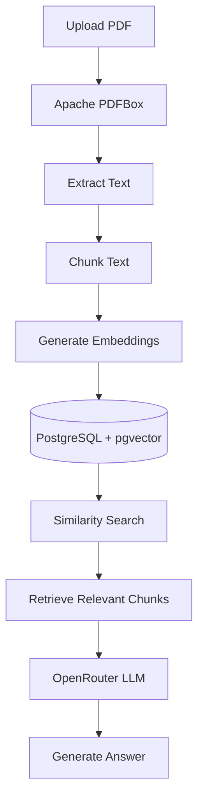

# 📄 AI-Powered Document Question Answering System (RAG)

<p align="center">


</p>

An **AI-powered backend application** built with **Java Spring Boot** that enables users to upload PDF documents and ask natural language questions about their content using **Retrieval-Augmented Generation (RAG)**.

Instead of sending an entire document to the Large Language Model (LLM), the application retrieves only the most relevant document chunks using **semantic vector search**, resulting in faster, more accurate, and context-aware responses.

---

# 🎯 Problem Statement

Large Language Models cannot reliably answer questions about private PDF documents because the information is not part of their training data.

This project solves that problem by implementing a complete **Retrieval-Augmented Generation (RAG)** pipeline that:

- Extracts text from uploaded PDFs
- Converts text into vector embeddings
- Stores embeddings in PostgreSQL using pgvector
- Retrieves the most relevant chunks
- Sends only the required context to the LLM
- Returns accurate responses based on the uploaded document

---

# ✨ Features

- 📄 Upload PDF documents
- ✂️ Intelligent text chunking
- 🧠 Generate embeddings using Google Gemini
- 🗄 Store vectors in PostgreSQL with pgvector
- 🔍 Semantic similarity search
- 🤖 Context-aware answer generation using OpenRouter
- ⚡ REST APIs built with Spring Boot
- 🏗 Clean layered architecture
- 📦 Maven project structure

---

# 🏗 System Architecture



---

# 🛠 Tech Stack

| Category | Technology |
|------------|------------|
| Language | Java 21 |
| Framework | Spring Boot 3 |
| Database | PostgreSQL |
| Vector Database | pgvector |
| PDF Processing | Apache PDFBox |
| Embedding Model | Google Gemini Embeddings API |
| LLM | OpenRouter |
| Build Tool | Maven |
| API Testing | Postman |

---

# 📂 Project Structure

```
src
│
├── controller
│     REST API Endpoints
│
├── service
│     Business Logic
│
├── repository
│     Database Layer
│
├── entity
│     JPA Entities
│
├── dto
│     Request & Response Models
│
└── resources
      Configuration Files
```

---

# 🚀 Getting Started

## 1. Clone Repository

```bash
git clone https://github.com/prathamsen2004/rag-document-qa.git
```

---

## 2. Navigate to Project

```bash
cd rag-document-qa
```

---

## 3. Configure Environment

Create

```
application.properties
```

from

```
application.properties.example
```

Update the following values:

```properties
spring.datasource.url=

spring.datasource.username=

spring.datasource.password=

google.ai.api-key=

openrouter.api.key=
```

---

## 4. Run PostgreSQL

Ensure PostgreSQL is running and the **pgvector** extension is enabled.

---

## 5. Run the Application

```bash
mvn spring-boot:run
```

The application will start on

```
http://localhost:8080
```

---

# 📡 REST APIs

## Upload PDF

```http
POST /documents/upload
```

Uploads and processes a PDF document.

---

## Ask Question

```http
POST /chat/ask
```

### Request

```json
{
  "question": "Summarize the uploaded document."
}
```

### Response

```json
{
  "answer": "..."
}
```

---

# 🧠 How Retrieval-Augmented Generation (RAG) Works

### Step 1

Upload a PDF document.

↓

### Step 2

Extract text using Apache PDFBox.

↓

### Step 3

Split the document into smaller chunks.

↓

### Step 4

Generate vector embeddings using Google Gemini.

↓

### Step 5

Store embeddings inside PostgreSQL (pgvector).

↓

### Step 6

Convert the user's question into an embedding.

↓

### Step 7

Perform semantic similarity search to retrieve the most relevant chunks.

↓

### Step 8

Send only those retrieved chunks to the LLM.

↓

### Step 9

Generate an accurate, context-aware answer.

---

# 📸 Demo

### Ask Questions about Uploaded Documents

> Add your Postman screenshot here.

Example:

```
Question:

What technical skills does Pratham have?

↓

Answer:

Java, Spring Boot, PostgreSQL,
REST APIs, AI Integration,
Vector Databases...
```

---

# 🌟 Why RAG?

Traditional LLMs rely only on pre-trained knowledge and may generate hallucinated answers for private documents.

RAG improves answer quality by retrieving relevant information from the uploaded document before generating the response.

Benefits include:

- Better factual accuracy
- Lower hallucination rate
- Context-aware answers
- Support for private documents
- Scalable knowledge retrieval

---

# 🔮 Future Improvements

- Authentication & Authorization
- Multi-document support
- Chat history
- React Frontend
- Docker support
- AWS Deployment
- Streaming responses
- Hybrid Search (Keyword + Vector Search)
- Conversation Memory

---

# 👨‍💻 Author

**Pratham Sen**

If you found this project useful, consider giving it a ⭐ on GitHub.

---

## ⭐ Support

If you like this project, don't forget to star the repository!
